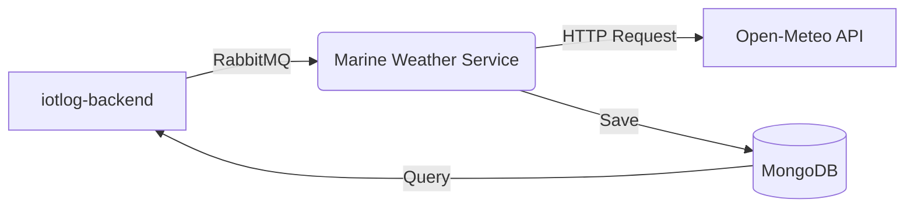

# IoTLog Marine Weather Service

Microserviço responsável por coletar, processar e armazenar dados meteorológicos marítimos para embarcações do sistema IoTLog.

## 📋 Visão Geral

Este serviço escuta mensagens via RabbitMQ contendo a localização de embarcações, consulta a API gratuita [Open-Meteo Marine](https://open-meteo.com/en/docs/marine-weather-api) e armazena previsões e condições históricas no MongoDB.

### Fluxo de Dados



## 🛠️ Tecnologias

- **Linguagem**: TypeScript / Node.js
- **Banco de Dados**: MongoDB (Mongoose)
- **Mensageria**: RabbitMQ (amqplib)
- **API Externa**: Open-Meteo Marine Weather API
- **Testes**: Jest + MongoDB Memory Server

## 🚀 Instalação e Execução

### Pré-requisitos
- Node.js 18+
- MongoDB rodando
- RabbitMQ rodando

### Passo a Passo

1. **Instale as dependências:**
   ```bash
   yarn install
   ```

2. **Configure o ambiente:**
   ```bash
   cp .env.example .env
   # Edite as variáveis conforme necessário (ver seção Configuração)
   ```

3. **Execute em desenvolvimento:**
   ```bash
   yarn dev
   ```

4. **Execute em produção:**
   ```bash
   yarn build
   yarn start
   ```

### 🐳 Via Docker

```bash
docker build -t iotlog-marine-weather .
docker run -d \
  --name marine-weather \
  -e MONGO_URI=mongodb://host.docker.internal:27017 \
  -e MESSAGE_QUEUE_HOST=host.docker.internal \
  iotlog-marine-weather
```

## ⚙️ Configuração (.env)

| Variável | Descrição | Padrão |
|----------|-----------|--------|
| `MONGO_URI` | String de conexão MongoDB | `mongodb://localhost:27017` |
| `MESSAGE_QUEUE_HOST` | Host do RabbitMQ | `localhost` |
| `MARINE_WEATHER_EXCHANGE` | Nome do Exchange | `marine_weather` |
| `MARINE_WEATHER_QUEUE` | Nome da Fila | `marine_weather_queue` |

## 🔌 Integração

### Publicar Mensagem (Request de Clima)

Envie uma mensagem para o exchange `marine_weather` (fanout) com o seguinte payload JSON:

```json
{
  "idAsset": "VESSEL-001",           // ID interno da embarcação (Obrigatório)
  "_idAsset": "507f1f77bcf86cd799...", // ObjectId do MongoDB (Opcional)
  "latitude": -23.5505,              // Latitude (Obrigatório)
  "longitude": -46.6333,             // Longitude (Obrigatório)
  "date": "2025-12-09",              // Data de interesse YYYY-MM-DD
  "timezone": "America/Sao_Paulo"    // Opcional
}
```

### Agendamento Diário (Exemplo)

Para coletar dados diariamente para toda a frota, implemente um cron job no backend principal:

```typescript
// Exemplo usando node-cron no backend principal
cron.schedule('0 6 * * *', async () => {
    const vessels = await VesselRepository.findActive();
    for (const vessel of vessels) {
        publishToRabbitMQ({
            idAsset: vessel.id,
            latitude: vessel.lastPosition.lat,
            longitude: vessel.lastPosition.lon,
            date: new Date().toISOString()
        });
    }
});
```

## 💾 Dados Armazenados

Os dados são salvos na coleção `marineWeatherData`.

**Estrutura do Documento:**
```typescript
{
  idAsset: "VESSEL-001",
  date: ISODate("2025-12-09T00:00:00Z"),
  location: { type: "Point", coordinates: [-46.6333, -23.5505] },
  data: {
    hourly: {
      time: [...],
      wave_height: [...],       // Altura das ondas (m)
      wave_direction: [...],    // Direção das ondas (graus)
      wave_period: [...],       // Período das ondas (s)
      wind_wave_height: [...],  // Ondas de vento
      swell_wave_height: [...], // Swell
      ocean_current_velocity: [...] // Correnteza (kn)
    }
  },
  extra: {
    source: "open-meteo",
    dataType: "marine_weather_conditions"
  }
}
```

## 🧪 Testes

O projeto conta com testes de integração que usam MongoDB em memória (para testes rápidos) ou local (para debug).

```bash
# Rodar testes
npm test

# Rodar com watch mode
npm run test:watch

# Ver cobertura
npm run test:coverage
```

### Simulação Real

Há um script de teste (`__tests__/simulation.test.ts`) configurado para validar coordenadas reais marítimas e garantir que a API externa está retornando dados válidos (não nulos).

## � Comandos Úteis

```bash
# Publicar mensagem de teste manual
npx tsx examples/publishMessage.ts

# Consultar dados salvos
npx tsx examples/queryData.ts
```

---
**IoTLog Marine Weather Service** 🌊⛵
